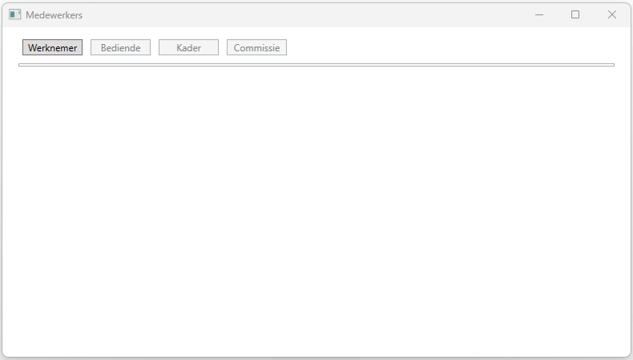
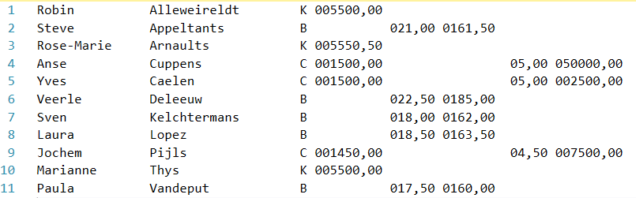
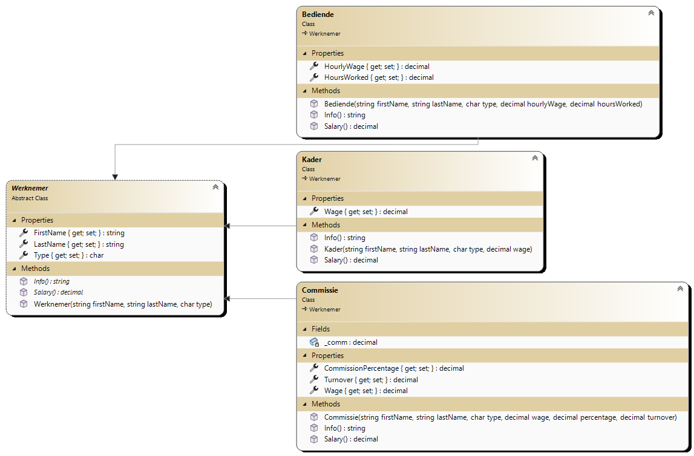

In deze toepassing ga je het tekstbestand *Werknemers.txt* uitlezen waarin de gegevens van het kaderpersoneel, de bedienden en het personeel dat op commissie werkt, zijn opgenomen. Je gaat alle data-gerelateerde zaken in een classlib steken om ze vervolgens in een WPF applicatie en een console applicatie uit te lezen.

> Maak 1 solution waar je de 3 projecten inzet.

## Deel 1: Class library ##
In deze class libray maak je een klasse aan voor elke entiteit.
> [!TIP]  Zorg dat je structuur brengt door gebruik te maken van folders

### DataAccess ###
Het bestand *werknemers.txt* bevat in totaal 7 velden die een vaste lengte hebben. De eerste 3 velden bevatten altijd gegevens (*naam*, *voornaam* en *type*).

- FirstName - 15
- LastName - 20
- Type - 2

Afhankelijk van het type werknemer moeten andere gegevens (en dus ook andere posities) worden uitgelezen.

- K(ader)
    - Wage - 9
- B(edienden)
    - HourlyWage - 6
    - HoursWorked - 7
- C(ommissie)
    - Wage - 9
    - (Commissie)Percentage - 5
    - Turnover - 9

Je mag er van uitgaan dat bij deze structuur nooit fouten zijn en dat het bestand aanwezig is op de door u bepaalde locatie. Het aantal records in het tekstbestand is niet vast.

Maak een methode **ReadFile(string fileName)** die het tekstbestand uitleest en de juiste klassen gebruikt om een lijst van werknemers terug te geven.

> Plaats dit in de DataAccess folder

### Entities ###
Maak voor deze toepassing een ***abstracte klasse*** **Werknemer** en 3 afgeleide klassen: **Bedienden**, **Commissie** en **Kader**.

De klasse ***Werknemer*** bevat 2 abstracte methoden die in de afgeleide klassen overgeërfd worden.

Klasse ***Commissie*** :
-   *Wedde()* berekent salaris + commissie.
-   *Info()* geeft onderstaande afdruk.

> {Type} | {naam, -15} wedde (incl. comm.): {Salaris:c} + {comm:c} = {Wedde():c}

Klasse ***Kader*** omvat:
-   *Wedde()* geeft salaris uit tekstbestand.
-   *Info()* geeft onderstaande afdruk.

> {Type} | {naam, -25} wedde: {Salaris:c}

Klasse ***Bedienden*** omvat:
-   *Wedde()* berekent uurloon \* aantal gewerkte uren.
-   *Info()* geeft onderstaande afdruk.

> {Type} | {naam, -25} wedde: {Uurloon:c} x {UrenGewerkt} = {Wedde():c}

## Deel 2: WPF applicatie ##
Maak een WPF applicatie met 4 knoppen en een listbox. Bij de start van de applicatie is enkel de knop **Werknemer** beschikbaar. Wanneer er op geklikt wordt, worden alle records uit het bestand *Werknemers.txt* gelezen en bewaard in *List\<Werknemer\>*. Hiervoor wordt gebruik gemaakt van de class library die je in het eerste deel gemaakt hebt.
> Gebruik telkens een object van de nodige class (`Commissie`, `Kader` of `Bediende`) en voeg deze toe aan de *List\<Werknemer\>*.

Hierna worden alle items in de List toegevoegd aan de ListBox.

De ingelezen records worden getoond in onderstaand formaat. Daarna wordt de knop uitgeschakeld en worden de andere 3 knoppen beschikbaar.

> [!TIP] Gebruik hiervoor de ToString() method

> {item.Voornaam} {item.Familienaam} - {item.Wedde():c}

De andere 3 knoppen zijn filters. Elke knop gaat door de *List\<Werknemer\>* en filtert de items uit waar het type overeenkomt met de gekozen filter. Gebruik de *Info()* method om de gegevens te tonen in de ListBox.

## Deel 3: Console applicatie ##
